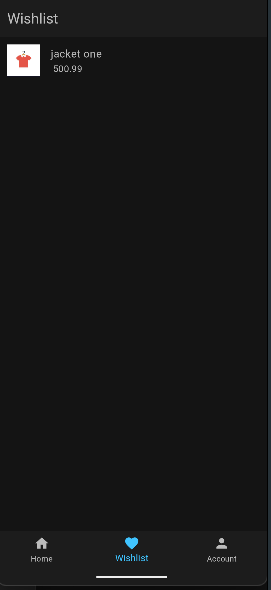
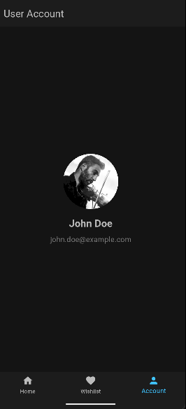
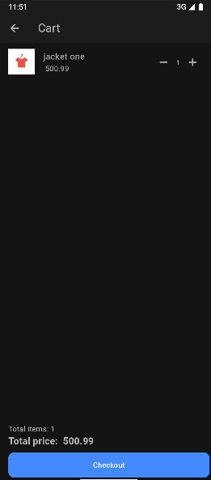
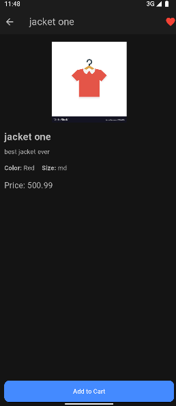
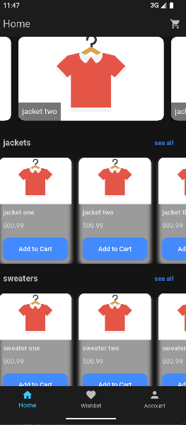

# 🛍️ Clothing App Prototype

This project is a functional prototype of a **clothing e-commerce mobile application** built with **Flutter** using the **Clean Architecture** pattern. It emphasizes modularity, scalability, and separation of concerns.

## 🧱 Architecture Overview

The app is structured into clearly separated layers:

lib/
├── wishlist/
│ ├── data/ # Data layer: handles models, data sources, repo implementations
│ ├── domain/ # Domain layer: contains entities, abstract repositories, and use cases
│ ├── presentation/ # Presentation layer: includes cubits, UI screens, widgets

Each feature follows its own domain-data-presentation structure to ensure **feature modularity** and **testability**.

---

## ✨ Features

- 🧾 **Product Catalog**
  - View a list of products grouped by categories.
  - Each product displays image, name, price, and a brief description.

- 📄 **Product Details**
  - Detailed view of each product with image, color, size, price, and description.
  - Users can add products to their **cart** or **wishlist**.

- ❤️ **Wishlist**
  - Add or remove products to/from the wishlist.
  - View a separate screen to see all favorite items.

- 🛒 **Shopping Cart**
  - Add products to cart (no checkout logic yet).
  - Snackbar feedback confirms items added to the cart.

- 🔐 **Firebase Authentication (in progress)**
  - Integrated with **Firebase Auth** (email/password login).
  - The authentication flow is functional but still being fully polished.

---

## 🧰 Tech Stack

- ⚙ **Flutter**
- 🧠 **BLoC/Cubit** for state management
- 🏗 **Clean Architecture**
- ✅ **Dartz** for functional programming (`Either`, `Option`)
- 🟩 **Equatable** for value comparison
- 🔥 **Firebase** (Authentication)
- 📦 **Local Data Source** for wishlist persistence (prototype)

---

## 📂 Project Example Structure

Here is a visual representation of how the `wishlist` feature is organized:

## 📱 App Screenshots

  
  
  
  
  
  

---

## 🚧 Work in Progress

- Full Firebase auth integration (sign up, log in, logout)
- Firestore database for wishlist/cart persistence
- Search and filter functionality
- Checkout & payment process

---

## 👨‍💻 Author

This project was built as a **learning prototype** to practice:
- Clean Architecture in Flutter
- Feature-based project structuring
- Firebase backend integration
